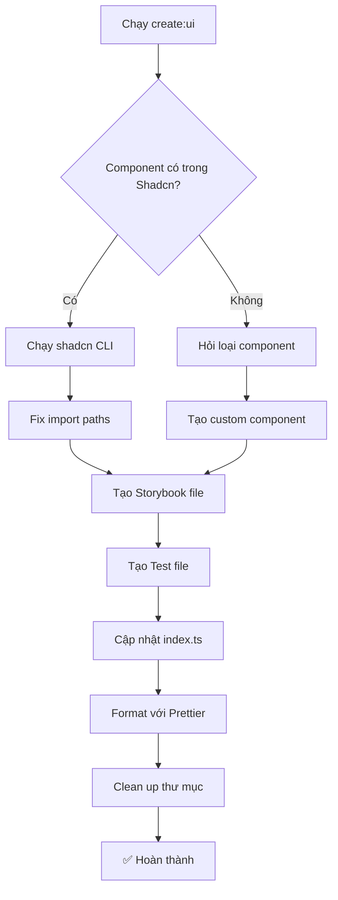

# 🚀 Social Media NX Monorepo

Dự án Social Media được xây dựng trên NX Monorepo với kiến trúc Atomic Design, sử dụng React, TypeScript, Next.js và Tailwind CSS.

## 📁 Cấu trúc dự án

```
social-media/
├── 📱 apps/                          # Ứng dụng chính
│   └── dating-app/                   # App hẹn hò
│       ├── src/
│       │   ├── app/                  # Pages và layouts
│       │   │   ├── (auth)/           # Auth pages
│       │   │   └── profile/          # Profile pages
│       │   └── components/           # App-specific components
│       ├── public/                   # Static assets
│       └── tsconfig.json             # TypeScript config
│
├── 🧩 libs/                          # Thư viện UI components
│   ├── atoms/                        # Components cơ bản
│   │   ├── src/
│   │   │   ├── button/               # Button component
│   │   │   ├── input/                # Input component
│   │   │   ├── progress/             # Progress component
│   │   │   └── stepIndicator/        # Step indicator
│   │   └── tsconfig.lib.json
│   │
│   ├── molecules/                    # Components phức tạp hơn
│   │   ├── src/
│   │   │   ├── sidebar/              # Sidebar navigation
│   │   │   ├── floatingIcons/        # Floating icons
│   │   │   └── phoneMockup/          # Phone mockup
│   │   └── tsconfig.lib.json
│   │
│   ├── organisms/                    # Components phức tạp nhất
│   │   ├── src/
│   │   │   ├── datePicker/           # Date picker
│   │   │   └── dateRangePicker/      # Date range picker
│   │   └── tsconfig.lib.json
│   │
│   └── templates/                    # Page templates
│       ├── src/
│       └── tsconfig.lib.json
│
├── 🎨 assets/                        # Assets chia sẻ (ROOT LEVEL)
│   ├── icons/                        # SVG icons
│   │   ├── ChatBubbleIcon.tsx
│   │   ├── DatingMessageIcon.tsx
│   │   ├── HeartIcon.tsx
│   │   ├── LocationPinIcon.tsx
│   │   └── Logo.tsx
│   ├── images/                       # Images
│   ├── fonts/                        # Fonts
│   ├── index.ts                      # Export file
│   ├── package.json                  # Package config
│   ├── project.json                  # NX project config
│   └── tsconfig.json                 # TypeScript config
│
├── 🪝 hooks/                         # React hooks chia sẻ (ROOT LEVEL)
│   ├── useDeviceDetection.ts         # Device detection hook
│   ├── useMediaQuery.ts              # Media query hooks
│   ├── index.ts                      # Export file
│   ├── package.json                  # Package config
│   ├── project.json                  # NX project config
│   └── tsconfig.json                 # TypeScript config
│
├── 🎨 styles/                        # Global styles (ROOT LEVEL)
│   └── globals.css                   # Tailwind CSS
│
├── 📋 Config files
│   ├── nx.json                       # NX workspace config
│   ├── package.json                  # Root package.json
│   ├── tsconfig.base.json            # Base TypeScript config
│   ├── tailwind.config.js            # Tailwind config
│   └── prettier.config.js            # Prettier config
│
└── 📚 README.md                      # Documentation
```

## 🔧 Cách tạo thư mục mới ở ROOT LEVEL

### **Bước 1: Tạo cấu trúc thư mục**

```bash
# Tạo thư mục mới (ví dụ: utils)
mkdir utils

# Tạo các file cần thiết
touch utils/index.ts
touch utils/package.json
touch utils/project.json
touch utils/tsconfig.json
```

### **Bước 2: Cấu hình package.json**

```json
// utils/package.json
{
  "name": "@social-media/utils",
  "version": "1.0.0",
  "description": "Shared utility functions",
  "main": "index.ts",
  "types": "index.ts",
  "private": true,
  "keywords": ["utils", "helpers", "shared"],
  "peerDependencies": {
    "react": ">=16.8.0"
  }
}
```

### **Bước 3: Cấu hình project.json (NX)**

```json
// utils/project.json
{
  "name": "utils",
  "$schema": "../node_modules/nx/schemas/project-schema.json",
  "sourceRoot": "utils",
  "projectType": "library",
  "tags": ["scope:shared", "type:util"],
  "targets": {
    "lint": {
      "executor": "@nx/eslint:lint",
      "outputs": ["{options.outputFile}"],
      "options": {
        "lintFilePatterns": ["utils/**/*.{ts,tsx,js,jsx}"]
      }
    },
    "type-check": {
      "executor": "@nx/js:tsc",
      "outputs": ["{options.outputPath}"],
      "options": {
        "outputPath": "dist/utils",
        "main": "utils/index.ts",
        "tsConfig": "utils/tsconfig.json"
      }
    }
  }
}
```

### **Bước 4: Cấu hình tsconfig.json**

```json
// utils/tsconfig.json
{
  "extends": "../tsconfig.base.json",
  "compilerOptions": {
    "module": "esnext",
    "lib": ["DOM", "DOM.Iterable", "ES6"],
    "allowJs": true,
    "skipLibCheck": true,
    "esModuleInterop": true,
    "allowSyntheticDefaultImports": true,
    "strict": true,
    "forceConsistentCasingInFileNames": true,
    "moduleResolution": "node",
    "resolveJsonModule": true,
    "isolatedModules": true,
    "noEmit": true,
    "jsx": "react-jsx"
  },
  "include": [
    "**/*.ts",
    "**/*.tsx",
    "**/*.js",
    "**/*.jsx"
  ],
  "exclude": [
    "node_modules",
    "dist"
  ]
}
```

### **Bước 5: Cập nhật tsconfig.base.json**

```json
// tsconfig.base.json
{
  "compilerOptions": {
    "paths": {
      "@social-media/styles": ["./styles/globals.css"],
      "@styles/*": ["./styles/*"],
      "@social-media/assets": ["./assets/index.ts"],
      "@assets/*": ["./assets/*"],
      "@social-media/hooks": ["./hooks/index.ts"],
      "@hooks/*": ["./hooks/*"],
      "@social-media/utils": ["./utils/index.ts"],  // ← Thêm dòng này
      "@utils/*": ["./utils/*"]                     // ← Thêm dòng này
    }
  }
}
```

### **Bước 6: Cập nhật package.json root**

```json
// package.json (root)
{
  "workspaces": [
    "apps/*",
    "libs/*",
    "hooks",
    "styles",
    "assets",
    "utils"    // ← Thêm dòng này
  ]
}
```

### **Bước 7: Cấu hình TypeScript cho libs**

**Cập nhật tất cả `libs/*/tsconfig.lib.json`:**

```json
// libs/atoms/tsconfig.lib.json, libs/molecules/tsconfig.lib.json, etc.
{
  "compilerOptions": {
    "outDir": "dist",
    "rootDir": "../..",           // ← Quan trọng: Set về project root
    "baseUrl": ".",
    "skipLibCheck": true,         // ← Quan trọng: Skip lib checking
    "allowJs": true,              // ← Quan trọng: Allow JS files
    "paths": {
      "src/*": ["src/*"],
      "@social-media/assets": ["../../assets/index.ts"],
      "@assets/*": ["../../assets/*"],
      "@social-media/hooks": ["../../hooks/index.ts"],
      "@hooks/*": ["../../hooks/*"],
      "@social-media/utils": ["../../utils/index.ts"],    // ← Thêm
      "@utils/*": ["../../utils/*"]                        // ← Thêm
    }
  },
  "include": [
    "src/**/*.ts",
    "src/**/*.tsx",
    "../../assets/**/*.ts",       // ← Quan trọng: Include external files
    "../../assets/**/*.tsx",
    "../../hooks/**/*.ts",
    "../../hooks/**/*.tsx",
    "../../utils/**/*.ts",        // ← Thêm
    "../../utils/**/*.tsx"        // ← Thêm
  ]
}
```

### **Bước 8: Cấu hình TypeScript cho apps**

**Cập nhật `apps/*/tsconfig.json`:**

```json
// apps/dating-app/tsconfig.json
{
  "compilerOptions": {
    "rootDir": "../..",           // ← Quan trọng: Set về project root
    "skipLibCheck": true,         // ← Quan trọng: Skip lib checking
    "paths": {
      "@/*": ["./src/*"],
      "@social-media/assets": ["../../assets/index.ts"],
      "@social-media/hooks": ["../../hooks/index.ts"],
      "@social-media/utils": ["../../utils/index.ts"]     // ← Thêm
    }
  },
  "include": [
    "src/**/*.ts",
    "src/**/*.tsx",
    "../../assets/**/*.ts",       // ← Include external files
    "../../assets/**/*.tsx",
    "../../hooks/**/*.ts",
    "../../hooks/**/*.tsx",
    "../../utils/**/*.ts",        // ← Thêm
    "../../utils/**/*.tsx"        // ← Thêm
  ]
}
```

## 🎯 Sử dụng trong dự án

### **Import từ thư mục ROOT LEVEL:**

```tsx
// ✅ Import assets
import { LogoIcon, HeartIcon } from '@social-media/assets'

// ✅ Import hooks
import { useDeviceDetection, useIsMobile } from '@social-media/hooks'

// ✅ Import utils (ví dụ)
import { formatDate, validateEmail } from '@social-media/utils'

// ✅ Import styles
import '@social-media/styles'
```

### **Sử dụng trong component:**

```tsx
import React from 'react'
import { LogoIcon } from '@social-media/assets'
import { useDeviceDetection } from '@social-media/hooks'
import { formatDate } from '@social-media/utils'

const MyComponent = () => {
  const { isMobile, deviceType } = useDeviceDetection()
  const currentDate = formatDate(new Date())

  return (
    <div>
      <LogoIcon />
      <p>Device: {deviceType}</p>
      <p>Date: {currentDate}</p>
      {isMobile ? 'Mobile View' : 'Desktop View'}
    </div>
  )
}

export default MyComponent
```

## 🔑 Key Points để nhớ

### **1. Cấu hình TypeScript quan trọng:**
- ✅ `"rootDir": "../.."` - Set về project root
- ✅ `"skipLibCheck": true` - Skip external lib checking
- ✅ `"allowJs": true` - Allow JS files
- ✅ Include external files trong `"include"` array

### **2. Pattern đặt tên:**
- ✅ Thư mục: `kebab-case` (utils, assets, hooks)
- ✅ Package name: `@social-media/folder-name`
- ✅ Import path: `@social-media/folder-name`

### **3. Cấu trúc file bắt buộc:**
- ✅ `index.ts` - Export file
- ✅ `package.json` - Package metadata
- ✅ `project.json` - NX project config
- ✅ `tsconfig.json` - TypeScript config

### **4. Workspaces:**
- ✅ Thêm vào `package.json` root workspaces
- ✅ Thêm paths vào `tsconfig.base.json`
- ✅ Cập nhật tất cả libs và apps tsconfig

## 🚀 Commands hữu ích

```bash
# Chạy dev server
npx nx dev dating-app

# Build production
npx nx build dating-app

# Lint code
npx nx lint dating-app

# Type check
npx nx type-check hooks

# Xem dependency graph
npx nx graph

# List tất cả projects
npx nx show projects
```

## 📚 Tài liệu tham khảo

- [NX Documentation](https://nx.dev)
- [Atomic Design](https://bradfrost.com/blog/post/atomic-web-design/)
- [TypeScript Paths](https://www.typescriptlang.org/docs/handbook/module-resolution.html#path-mapping)
- [Tailwind CSS](https://tailwindcss.com/docs)

---
# 🚀 Create Folder Script - NX Monorepo

Script tự động tạo thư mục mới ở ROOT LEVEL cho dự án NX monorepo với đầy đủ configuration.

## 📦 Cài Đặt

Đặt file `create-folder.js` vào thư mục root của dự án, cùng cấp với `package.json`.

Thêm script vào `package.json`:

```json
{
  "scripts": {
    "create-folder": "node create-folder.js"
  }
}
```

## 🚀 Sử Dụng

Chạy lệnh:

```bash
npm run create-folder
```

Script sẽ hỏi các câu hỏi bằng tiếng Việt:

### 1. Chọn Loại Thư Mục
```
📁 Chọn loại thư mục bạn muốn tạo:
❯ utils - Tiện ích và helper functions
  shared - Business logic chung  
  tools - Development tools
  configs - Configuration files
  constants - Hằng số chung
  services - API services
  validators - Validation schemas
  other - Loại khác (tự nhập)
```

### 2. Nhập Thông Tin
- **Tên thư mục**: Chỉ chấp nhận chữ thường, số và dấu gạch ngang
- **Mô tả**: Mô tả ngắn gọn về chức năng  
- **Keywords**: Từ khóa cách nhau bởi dấu phẩy
- **Xác nhận**: Xác nhận tạo thư mục

## 📁 Cấu Trúc Được Tạo

```
your-folder/
├── index.ts              # Export file
├── package.json          # Package metadata  
├── project.json          # NX project config
└── tsconfig.json         # TypeScript config
```

## ⚙️ Tự Động Cập Nhật

Script sẽ tự động cập nhật:

1. **tsconfig.base.json** - Thêm path mapping:
   ```json
   {
     "compilerOptions": {
       "paths": {
         "@social-media/your-folder": ["./your-folder/index.ts"],
         "@your-folder/*": ["./your-folder/*"]
       }
     }
   }
   ```

2. **package.json** root - Thêm workspace:
   ```json
   {
     "workspaces": [
       "apps/*",
       "libs/*", 
       "hooks",
       "assets",
       "styles",
       "your-folder"
     ]
   }
   ```

3. **libs/*/tsconfig.lib.json** - Thêm paths và includes cho tất cả libs

## 🎯 Sử Dụng Sau Khi Tạo

Import trong code:

```typescript
// Import toàn bộ
import { yourFunction } from '@social-media/your-folder'

// Import specific
import { specificUtil } from '@your-folder/specific-module'
```

Trong libs hoặc apps:

```typescript
// libs/atoms/src/some-component.tsx
import { helperFunction } from '@social-media/utils'
import { API_ENDPOINTS } from '@social-media/constants'
```

## ✅ Các Loại Thư Mục Phổ Biến

### Utils
```typescript
// utils/index.ts
export { formatDate } from './date-utils'
export { validateEmail } from './validation-utils'
export { calculateDistance } from './geo-utils'
```

### Shared
```typescript
// shared/index.ts
export * from './types'
export * from './api-client'
export * from './business-logic'
```

### Constants
```typescript
// constants/index.ts
export const API_ENDPOINTS = {
  AUTH: '/api/auth',
  USERS: '/api/users'
}

export enum UserRoles {
  USER = 'user',
  ADMIN = 'admin'
}
```

### Services
```typescript
// services/index.ts
export { AuthService } from './auth-service'
export { UserService } from './user-service'
export { ApiClient } from './api-client'
```

## 🔧 Troubleshooting

### Lỗi thường gặp:

1. **"Thư mục đã tồn tại"**: Chọn tên khác hoặc xóa thư mục cũ
2. **"Tên không hợp lệ"**: Chỉ dùng chữ thường, số và dấu gạch ngang
3. **"Không tìm thấy file config"**: Đảm bảo chạy script ở thư mục root

### Nếu có lỗi:
1. Xóa thư mục đã tạo (nếu có)
2. Revert các thay đổi trong config files
3. Chạy lại script

## 📚 Ví Dụ Sử Dụng

```bash
$ npm run create-folder

🚀 NX MONOREPO FOLDER CREATOR

📁 Chọn loại thư mục bạn muốn tạo: utils - Tiện ích và helper functions
📂 Nhập tên thư mục: (utils) 
📋 Nhập mô tả cho thư mục: (Shared utility functions và helper methods)
🏷️  Nhập keywords (cách nhau bởi dấu phẩy): (utils, helpers, shared)
✅ Xác nhận tạo thư mục với thông tin trên? Yes

🎉 HOÀN THÀNH!
✅ Đã tạo thư mục: utils
✅ Đã tạo tất cả files cần thiết  
✅ Đã cập nhật các config files

🚀 Bây giờ bạn có thể sử dụng:
import { ... } from '@social-media/utils'
```

## 🌟 Tính Năng

- ✅ Giao diện đẹp với màu sắc và emoji
- ✅ Câu hỏi tiếng Việt dễ hiểu
- ✅ Validation tên thư mục
- ✅ Templates có sẵn cho các loại phổ biến
- ✅ Tự động tạo tất cả files cần thiết
- ✅ Tự động cập nhật config files
- ✅ Hỗ trợ custom types
- ✅ Error handling và rollback

---

# 🎨 Create UI Script - Component Creator

Script tự động tạo UI components cho dự án NX monorepo với Atomic Design, hỗ trợ Shadcn UI, Storybook và Jest Testing.

## 📦 Cài Đặt

File `create-ui.js` đã có sẵn trong dự án, đặt ở thư mục root cùng cấp với `package.json`.

Script đã được cấu hình trong `package.json`:

```json
{
  "scripts": {
    "create:ui": "node create-ui.js"
  }
}
```

## 🚀 Sử Dụng

### Cách 1: Chạy với tên component
```bash
npm run create:ui button
npm run create:ui input-otp
npm run create:ui data-table
```

### Cách 2: Chạy interactively
```bash
npm run create:ui
```
Script sẽ hỏi tên component bạn muốn tạo.

## 🎯 Tính Năng Chính

### ✨ Tự Động Phân Loại Component
Script tự động xác định loại component dựa trên tên:

#### 🔹 **Atoms** (Thành phần cơ bản)
```
alert, avatar, badge, button, checkbox, dialog, input, 
input-otp, label, progress, radio, select, separator, 
skeleton, slider, switch, textarea, toast, toggle, 
aspect-ratio, breadcrumb
```

#### 🔸 **Molecules** (Kết hợp từ atoms)
```
card, calendar, command, dropdown-menu, hover-card, 
menubar, navigation-menu, pagination, popover, sheet, 
tabs, tooltip, accordion, context-menu, collapsible, 
carousel, alert-dialog, drawer
```

#### 🔺 **Organisms** (Kết hợp từ molecules)
```
data-table, form, sidebar, table, combobox, resizable, 
scroll-area, sonner, chart, radio-group, toggle-group
```

### 🛠️ Tự Động Cài Đặt Dependencies
Script tự động cài đặt các thư viện cần thiết:
- `chalk` - Màu sắc terminal
- `inquirer` - Menu tương tác
- `ora` - Spinner loading
- `boxen` - Tạo box đẹp
- `tailwindcss`, `tailwind-merge`, `clsx` - Styling
- `class-variance-authority`, `lucide-react` - UI utilities

### 📁 Cấu Trúc File Được Tạo

```
libs/[component-type]/src/[component-name]/
├── [component-name].tsx     # Component chính
├── index.stories.tsx        # Storybook stories
└── [component-name].test.tsx # Jest test file
```

**Ví dụ với `button`:**
```
libs/atoms/src/button/
├── button.tsx              # Button component
├── index.stories.tsx       # Button stories  
└── button.test.tsx         # Button tests
```

## 🎨 Hai Loại Component

### 1. 🎭 **Shadcn UI Components**
Nếu component có trong danh sách Shadcn UI:
- Sử dụng `shadcn@latest add [component]`
- Tự động fix import paths
- Clean up thư mục UI không cần thiết
- Di chuyển dependency atoms nếu cần

```bash
npm run create:ui button     # Tạo từ Shadcn UI
npm run create:ui card       # Tạo từ Shadcn UI
npm run create:ui data-table # Tạo từ Shadcn UI
```

### 2. 🛠️ **Custom Components**
Nếu component không có trong Shadcn UI:
- Tạo template component tùy chỉnh
- Hỏi người dùng chọn loại (atom/molecule/organism)
- Tạo với TypeScript interface đầy đủ

```bash
npm run create:ui my-custom-component
```

## 📚 Template Generated

### Component File (.tsx)
```typescript
import * as React from 'react'
import { cn } from 'src/utils'

export interface ButtonProps {
  className?: string
  children?: React.ReactNode
  [x: string]: any
}

const Button: React.FC<ButtonProps> = ({
  className,
  children,
  ...props
}) => {
  return (
    <div
      className={cn('button-container', className)}
      {...props}
    >
      {children || 'Button Component'}
    </div>
  )
}

export default Button
export { Button }
```

### Storybook File (.stories.tsx)
```typescript
import type { Meta, StoryObj } from '@storybook/react';
import { Button } from './button';

const meta: Meta<typeof Button> = {
  title: 'Atoms/Button',
  component: Button,
  tags: ['autodocs'],
  argTypes: {
    className: { control: 'text' },
    children: { control: 'text' },
  },
};

export default meta;
type Story = StoryObj<typeof Button>;

export const Default: Story = {
  args: {
    'data-testid': 'button',
    className: 'button-container',
    children: 'Button Example',
  },
};
```

### Test File (.test.tsx)
```typescript
import { render, screen } from '@testing-library/react'
import '@testing-library/jest-dom'
import * as stories from './index.stories'
import { Button } from './button'

describe('Button', () => {
  it('renders correctly from direct import', () => {
    render(<Button data-testid="button" />)
    expect(screen.getByTestId("button")).toBeInTheDocument()
  })

  it('renders with Default story props', () => {
    const defaultProps = stories.Default?.args || {}
    render(<Button {...defaultProps} data-testid="button-with-story-props" />)
    expect(screen.getByTestId("button-with-story-props")).toBeInTheDocument()
  })
})
```

## ⚙️ Tự Động Setup

Script tự động tạo/cập nhật các file cần thiết:

### 1. **components.json**
```json
{
  "$schema": "https://ui.shadcn.com/schema.json",
  "style": "default",
  "rsc": false,
  "tsx": true,
  "tailwind": {
    "config": "../../tailwind.config.js",
    "css": "../../styles/globals.css",
    "baseColor": "slate",
    "cssVariables": true
  },
  "aliases": {
    "components": "src",
    "utils": "src/utils"
  }
}
```

### 2. **src/utils/cn.ts**
```typescript
import { clsx, type ClassValue } from "clsx"
import { twMerge } from "tailwind-merge"

export function cn(...inputs: ClassValue[]): string {
  return twMerge(clsx(inputs))
}
```

### 3. **tailwind.config.js**
```javascript
const rootTailwindConfig = require('../../tailwind.config.js');

module.exports = {
  ...rootTailwindConfig,
  content: [
    './src/**/*.{ts,tsx,js,jsx,html}',
    '!./src/**/*.{stories,spec}.{ts,tsx,js,jsx,html}',
    ...rootTailwindConfig.content,
  ],
};
```

### 4. **Cập nhật index.ts**
```typescript
export * from './button/button';
export * from './input/input';
// ... other exports
```

## 🎯 Workflow Hoàn Chỉnh



## 🧪 Integration Testing

Sau khi tạo component, bạn có thể:

### 1. **Xem Storybook**
```bash
npm run storybook
```
Navigate đến: `Atoms/Button` hoặc `Molecules/Card`

### 2. **Chạy Tests**
```bash
npx nx test atoms    # Test atoms library
npx nx test molecules # Test molecules library
```

### 3. **Sử dụng Component**
```typescript
// Trong app hoặc lib khác
import { Button } from '@social-media/atoms'
import { Card } from '@social-media/molecules'

function MyPage() {
  return (
    <div>
      <Button>Click me</Button>
      <Card>Card content</Card>
    </div>
  )
}
```

## 🔧 Advanced Features

### Smart Component Detection
Script tự động xử lý:
- Dependency components (button trong form)
- Component naming (input-otp → inputOtp)
- Import path resolution
- Cross-library dependencies

### Auto Cleanup
- Xóa thư mục UI không cần thiết
- Di chuyển components vào đúng library
- Clean up empty directories
- Fix duplicate components

### Error Handling
- Rollback nếu có lỗi
- Detailed error messages
- File validation
- Dependency checking

## 📋 Ví Dụ Sử Dụng

### Tạo Button Component
```bash
$ npm run create:ui button

🎨 Component Creator
Công cụ tạo component nhanh chóng cho dự án React

⏳ Đang tạo component button trong atoms...
✅ Đã tạo component với shadcn CLI!
✅ Tìm thấy file component tại: libs/atoms/src/ui/button.tsx
✅ Đã lưu component vào: libs/atoms/src/button/button.tsx
✅ Đã tạo file Storybook cho component button
✅ Đã tạo file test kết nối với Storybook cho component button
✅ Đã cập nhật index.ts để export component mới
✅ Đã tạo thành công component button

✨ Quá trình tạo component đã hoàn tất!
```

### Tạo Custom Component
```bash
$ npm run create:ui my-widget

🚀 Component "my-widget" không phải là component từ Shadcn
? Chọn loại component: Molecule (kết hợp từ nhiều atoms)
✓ Đã chọn loại component: molecules
✅ Đã tạo thư mục myWidget trong molecules
✅ Đã tạo file component myWidget.tsx
✅ Đã tạo file Storybook cho component my-widget
✅ Đã tạo file test kết nối với Storybook cho component my-widget
✅ Đã cập nhật index.ts để export component mới

✨ Quá trình tạo component đã hoàn tất!
```

## 🔍 Troubleshooting

### Lỗi thường gặp:

1. **"Component không tồn tại trong Shadcn"**
   - Component sẽ được tạo như custom component
   - Chọn loại phù hợp khi được hỏi

2. **"Lỗi khi chạy shadcn CLI"**
   - Kiểm tra network connection
   - Đảm bảo có file components.json

3. **"Prettier format thất bại"**
   - Component vẫn được tạo thành công
   - Manual format: `npx prettier --write libs/atoms/src/button/button.tsx`

4. **"Import path không đúng"**
   - Script tự động fix paths
   - Kiểm tra src/utils/cn.ts có tồn tại

### Debug Mode:
Nếu có lỗi, kiểm tra:
```bash
ls libs/atoms/src/utils/  # Có cn.ts không?
cat libs/atoms/components.json  # Config đúng không?
npx shadcn@latest add button --dry-run  # Test shadcn CLI
```

## 🌟 Best Practices

### 1. **Naming Convention**
- Sử dụng kebab-case: `input-otp`, `data-table`
- Component name sẽ auto convert: `inputOtp`, `dataTable`

### 2. **Component Organization**
```
atoms/       → Cơ bản: button, input, badge
molecules/   → Tổ hợp: card, dropdown, pagination  
organisms/   → Phức tạp: form, table, sidebar
templates/   → Layout: page templates
```

### 3. **Story Writing**
- Mỗi component ít nhất 2 stories: Default, Customized
- Sử dụng controls để test props
- Document props với comments

### 4. **Testing Strategy**
- Test rendering với default props
- Test props từ stories
- Thêm custom test cases nếu cần

## 📊 Component Library Stats

Sau khi tạo components, kiểm tra:

```bash
# Xem tất cả components đã tạo
find libs -name "*.stories.tsx" | wc -l

# Xem test coverage
npx nx test atoms --coverage

# Build library
npx nx build atoms
npx nx build molecules
```

## 🚀 Next Steps

Sau khi tạo component:

1. ✅ Customize component logic
2. ✅ Add more story variants  
3. ✅ Write comprehensive tests
4. ✅ Update documentation
5. ✅ Use in your app

**Happy coding! 🎉**
